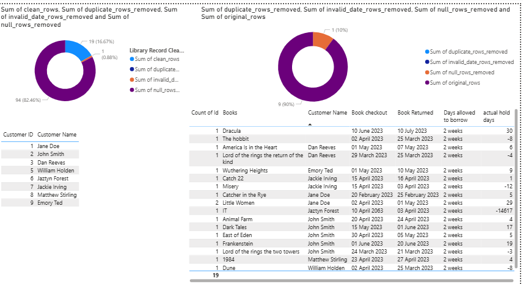
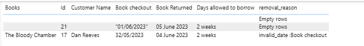

# DEM5-Module5
Scenario 

This is a sample Library data cleaning activity project. Project clean files and run it in a docker container.   

The demo has below library record files

1. Library Customer Record
2. Library Book Borrow Record

The cleaning activity includes
1. Clean Customer Record File - remove duplicates and Null 
2. Clean Record file - remove duplicates and null, remove invalid dates. 
3. Enrich Data by adding 2 extra measures
3. Copy dirty data into seprate files. 
4. logs the each cleaning stats into a seprate stat file. 

Finally create the PowerBI report to show the pipeline activity. 

TO DO : 
    - further cleaning on dates
        1. checkout - should not be future date
        2. return date should be greater than checkout date
    - store output into a persistent store like Database 
    - Schedule using Apache AirFlow. 
